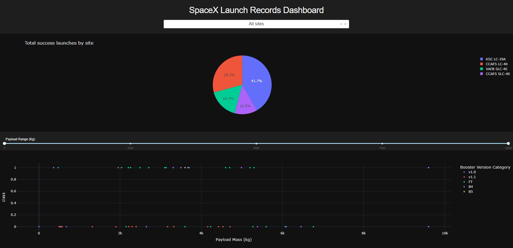
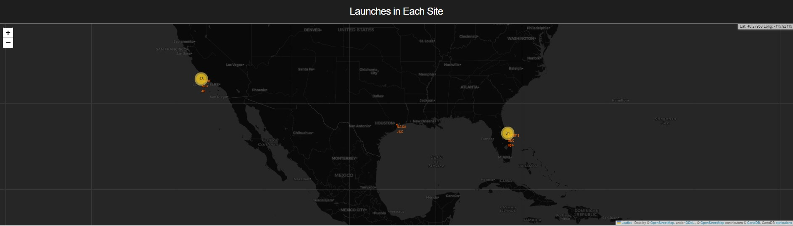
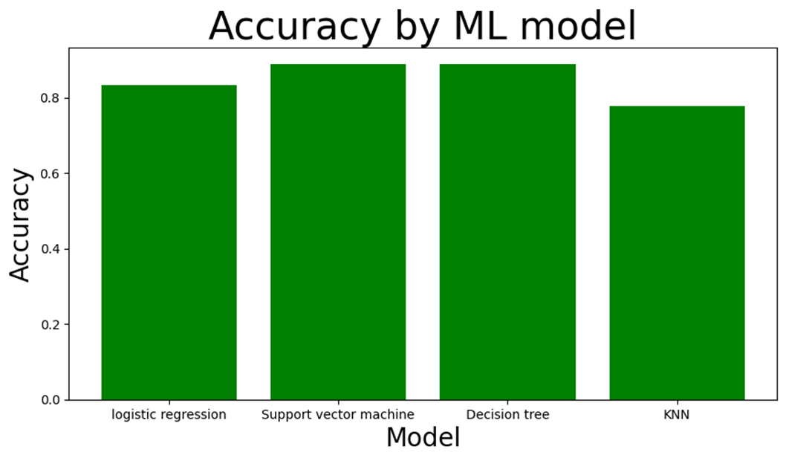

# Winning the Space Race with Data Science


## Background

Space exploration is experiencing unprecedented growth, with a growing interest in the commercial aspects of this field. SpaceX is at the forefront of making space travel more economically viable through a key strategy for cost reduction: the reusability of the first stage of its Falcon 9 rockets.

Currently, SpaceX launches Falcon 9 rockets at a significantly lower cost of $62 million, in stark contrast to other providers whose prices typically exceed $165 million. In an effort to revolutionize the space industry and compete with SpaceX's pricing, it is crucial for competitors to gain insights into the factors affecting launch costs, which underscores the importance of predicting the successful landing of the Falcon 9 first stage.

This project aims to predict whether the SpaceX Falcon 9 first stage will successfully land after launch. By making accurate predictions, we can estimate the cost of a launch, providing valuable information for competitors seeking to optimize their pricing strategies.

## Author

[@LucasBandeira](https://github.com/LucasTBandeira)

## Table of Contents

- [Application](#application)
- [Tech Stack](#tech-stack)
- [Usage](#usage)
- [Data Collection](#data-collection)
- [Data Analysis](#data-analysis)
- [Results](#results)

## Application

A user-friendly **[dashboard](https://spacex-rocket-landing-analysis.onrender.com/)** has been developed to provide an interactive exploration of SpaceX launch records. The dashboard is implemented using Dash, a Python framework for building analytical web applications. Users can visualize and analyze data related to SpaceX launches, including success rates, payload correlations, and launch site details.




## Tech Stack

- **Data Analysis:** Python, Pandas, NumPy

- **Exploratory Data Analysis (EDA):** Matplotlib, Seaborn

- **Geospatial Visualization:** Folium

- **Predictive Analysis:** Scikit-Learn

- **Dashboard:** Plotly, Dash, HTML, CSS

## Usage

To replicate and explore the analysis conducted in this project, follow these steps:

1. Clone the repository to your local machine:

```bash
git clone https://github.com/your-username/SpaceRaceDataScience.git
```

2. Navigate to the project directory:

```bash
cd SpaceRaceDataScience
```

3. Install the required dependencies:

```bash
pip install -r requirements.txt
```

4. Explore the Jupyter notebooks in the `notebooks/` directory for detailed analysis and insights.

5. Utilize the processed data in the `data/` directory for your own analyses.

## Data Collection

The data collected from the [SpaceX API](https://documenter.getpostman.com/view/1559645/RVtvsEFr) involves extracting information about past launches, including details about the booster version, payload mass, orbit, launch site, and outcomes. In addition to API data, this project also gathers information through web scraping from [Wikipedia](https://en.wikipedia.org/w/index.php?title=List_of_Falcon_9_and_Falcon_Heavy_launches&oldid=1027686922). The web scraping code extracts data related to Falcon 9 and Falcon Heavy launches. All the collected data is then processed and organized into a structured dataset for further analysis.

## Data Analysis

### Data Wrangling

The collected data goes through a data wrangling process to ensure its quality and prepare it for analysis. This includes filtering the data to focus on Falcon 9 launches, handling missing values, and fixing inconsistencies in the payload mass column.

### Exploratory Data Analysis (EDA)

In the EDA phase, an in-depth exploration and visualization of the data are conducted to extract insights into relationships and patterns. Various visualization techniques, including catplots, barplots, lineplots, and more, are employed to analyze critical factors such as flight number, payload mass, launch site, orbit type, success rate trends, and other pertinent features.

Feature engineering involves selecting and transforming relevant features for analysis. Additionally, one-hot encoding is applied to categorical variables for better representation in machine learning models.

The launch site analysis phase involves visualizing and marking the launch sites on a map. The project utilizes Folium, a Python library for creating interactive maps, to mark launch sites, visualize success/failure of launches, and calculate distances between the launch site and nearby landmarks.

## Results

In addition to exploratory data analysis, this project includes predictive analysis using machine learning models. The goal was to predict the success or failure of SpaceX Falcon 9 first-stage landings based on various features. Steps included:

- Data Loading and Standardization
- Train-Test Split
- Model Selection (Logistic Regression, SVM, Decision Tree, KNN)
- Hyperparameter Tuning
- Model Evaluation and Results Visualization



Decision Tree and SVM models had the best results in predicting Falcon 9 first stage landing, with 88.88% accuracy score.
